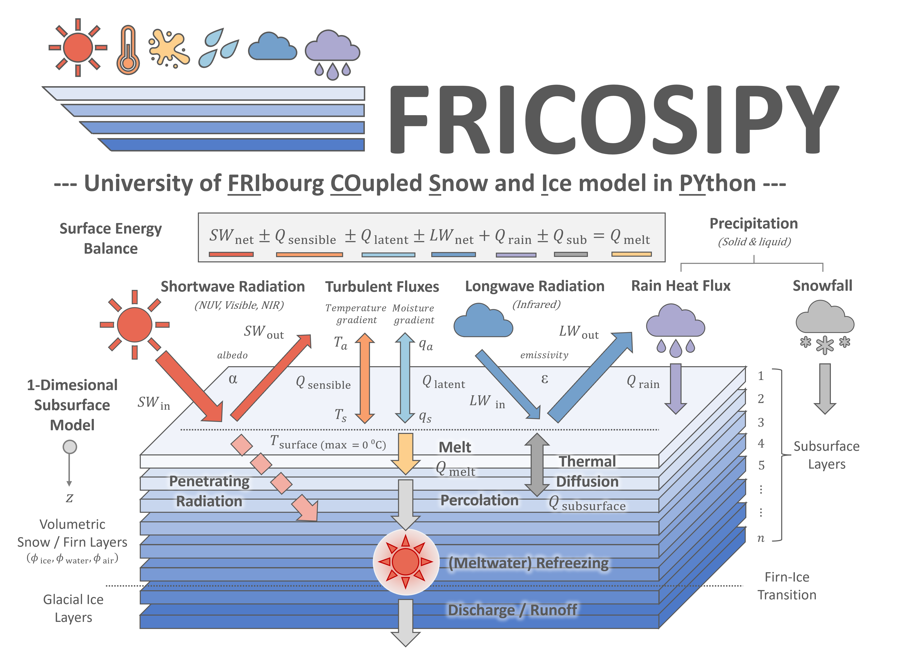

# FRICOSIPY

The *University of Fribourg variant of the Coupled Snow & Ice Model in Python (FRICOSIPY)* is a 
coupled surface energy balance and a 1-dimensonal, multi-layer subsurface firn model that evaluates the mass balance of a glacier.

*FRICOSIPY* has been developed as an adapation of the original [COSIPY v1.4](https://github.com/cryotools/cosipy) model of [Sauter et al. (2020)](https://doi.org/10.5194/gmd-13-5645-2020) and is designed to enhance the modelling of subsurface firn processes and enable greater accessibility for users with limited computational resources – principally by restructuring the core design to greatly improve memory/RAM optimisation.

The latest version of *FRICOSIPY* is available at: [https://github.com/MarcusGastaldello/FRICOSIPY](https://github.com/MarcusGastaldello/FRICOSIPY/releases).

---

<small> **Main Figure**: The FRICOSIPY Model & Logo </small>

**Citation:** *Gastaldello, M. (2026). FRICOSIPY - University of Fribourg variant of the Coupled Snow and Ice model in Python (Version 1.3) [Computer software]. [https://github.com/MarcusGastaldello/FRICOSIPY](https://github.com/MarcusGastaldello/FRICOSIPY).*

|||
|:---|:---|
| **Colle Gnifetti Paper**    |   |
| **Original COSIPY Model**   |   |
| **Documentation**           |  |
| **License**                 |  |
| **Support / Contact**       |   |

