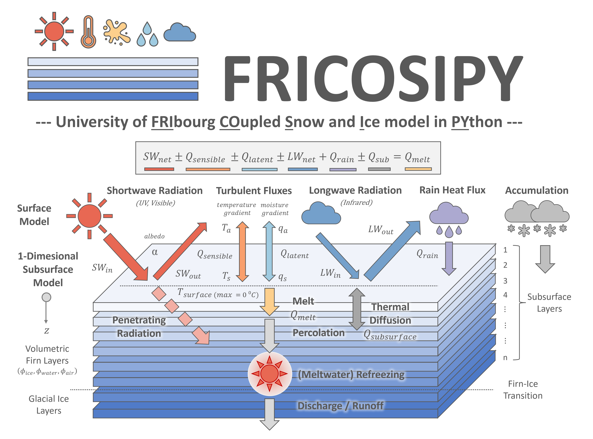

# Introduction

**FRICOSIPY** (The University of Fribourg variant of the Coupled Snow & Ice Model in Python) is a 1-dimensonal, coupled surface energy balance and
multi-layer subsurface firn model that evaluates the mass balance of a glacier.

FRICOSIPY has been developed as an adapation of the original [COSIPY v1.4](https://github.com/cryotools/cosipy) model of [Sauter et al. (2020)](https://doi.org/10.5194/gmd-13-5645-2020) and is designed to enhance the modelling of subsurface firn processes and enable greater accessibility for users with limited computational resources - principally by restructuring the core design to greatly improve memory/RAM optimisation.

The latest version of FRICOSIPY is available at: [https://github.com/MarcusGastaldello/FRICOSIPY](https://github.com/MarcusGastaldello/FRICOSIPY).

!!! note

    This user guide is currently under active development.

