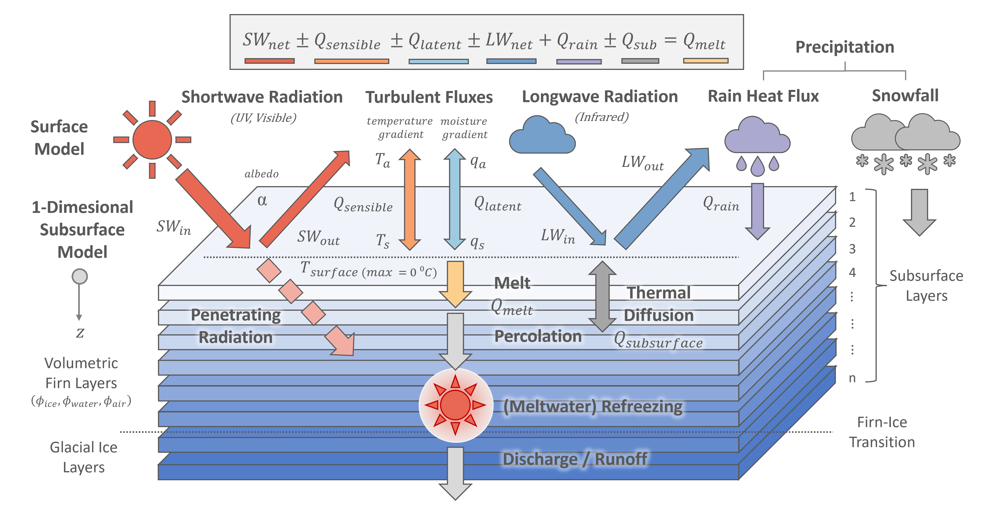

# Introduction

The *FRICOSIPY* model combines a surface energy balance 

For each simulation timestep, first the surface temperature of an infinitesimal skin-layer is determined by evaluating the surface energy fluxes – these are phyically derived or parameterised from the input meteorological and topographic data. Subsequently,  

The model is 1-dimensional; spatial nodes are simulated through time independantly, meaning there is no lateral transference of mass or energy. 

The *FRICOSIPY* model can be classified as a mid-complexity glacier model: it offers 

than basic temperature index models (eg. [Hock, 1999](https://doi.org/10.3189/S0022143000003087) , [Huss & Hock, 2015](https://doi.org/10.3389/feart.2015.00054)) but is less computationally expensive than complex 3-dimensional, thermomechanically-coupled *Stokes* ice flow models. However, it does require high resolution meteorological data and model performance is greatly influenced by the quality of this input data.

<small> **Figure 1**: The FRICOSIPY Model </small>

The following sections explain how the model functions in detail, outlining the paramterisations and key physical processes simulated in the model.
