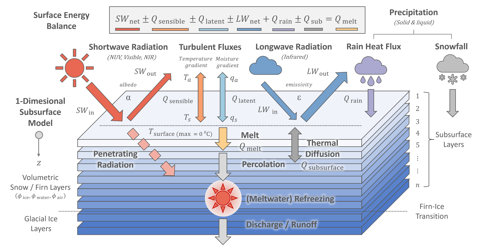

# Introduction

The *FRICOSIPY* model combines a [surface energy balance](https://fricosipy.readthedocs.io/en/latest/surface_energy_balance/) with a [multi-layer subsurface model](https://fricosipy.readthedocs.io/en/latest/subsurface_model/). For each simulation timestep, first the surface temperature of an infinitesimal skin-layer is determined by evaluating the surface energy fluxes – these are either phyically-derived or parameterised from the input meteorological and topographic data. Subsequently, the intrinsic properties of firn layers are updated according to subsurface physical process such as meltwater percolation & refreezing, thermal diffusion and dry densification. The subsurface grid is discretised according to a Lagrangian scheme with layers translating vertically according to mass exchange at the surface.

The model is 1-dimensional in space; each grid cell (or spatial node) is simulated independently through time, with no lateral transfer of heat or mass between adjacent nodes. However, it incorporates certain quasi-3-D processes, most notably the topographic shading of solar irradiance, which depends on the elevation of the surrounding terrain. The input meteorological data is also interpolated across the spatial domain from a user-defined reference point according to topographic factors.

*FRICOSIPY* is best characterised as a mid-complexity glacier model. It represents physical processes more comprehensively than basic temperature-index models (eg. [Hock, 1999](https://doi.org/10.3189/S0022143000003087) , [Huss & Hock, 2015](https://doi.org/10.3389/feart.2015.00054)) yet is less computationally expensive than more complex 3-dimensional, thermomechanically-coupled, *Stokes* ice flow models. However, it does still require high resolution meteorological data and model performance is greatly influenced by the quality of this input data.

<small> **Figure 1**: The FRICOSIPY Model </small>

The following sections explain how the model functions in detail, outlining the parameterisations and key physical processes simulated in the model.
