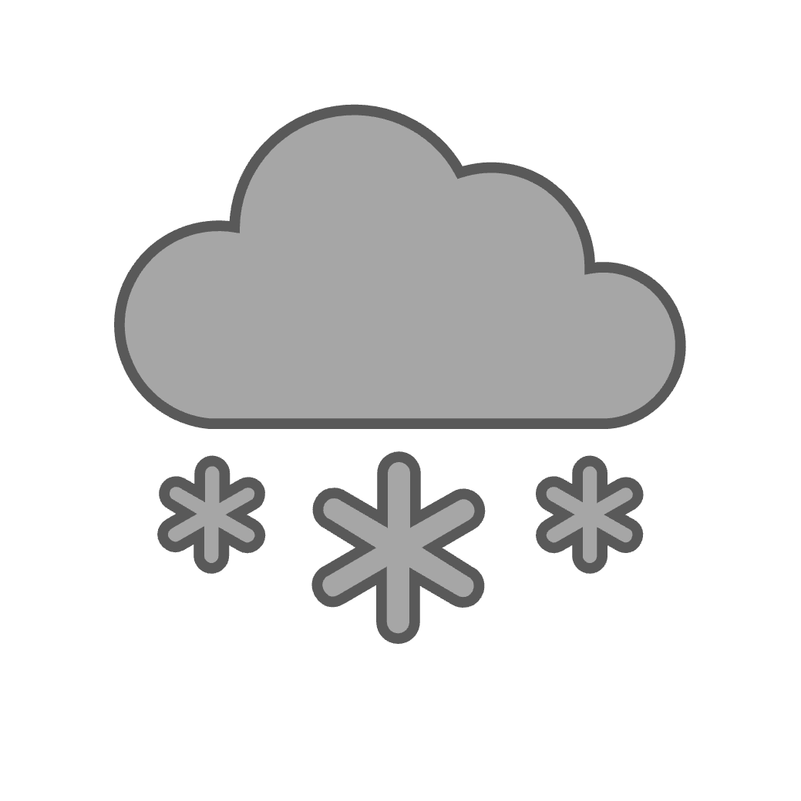

---
# Metadata
og_title: FRICOSIPY | The Model Input Files
og_description: Explanation of the three model model input files required to run a FRICOSIPY simulation
---

# Model Input Files

The *FRICOSIPY* model requires three input *Network Common Data Format* (NetCDF) files in order to run a simulation: *Static*, *Meteo* and *Illumination*. These replace the large 3-dimensional input dataset ( 𝑥 , 𝑦 , 𝑡 ) of the original *COSIPY* model in order to lessen the required computational resources and enable the execution of a simulation with a high spatio-temporal resolution. In *FRICOSIPY*, the meteorological data is instead interpolated across the spatial grid according to topographic variation during the main simulation.

<hr style="height:2px; background-color:#8b8b8b; border:none;" />

## $(1)$ Static File

{width="125px" align=left}

<br style="clear: both;" />

The model static input file contains topographic information that varies across the spatial domain  
( 𝑥 , 𝑦 ) and requires the following variables:

* **NORTHING** - Northing [m]
* **EASTING** - Easting [m]
* **LATITUDE** - Latitude (WGS84) [decimal]
* **LONGITUDE** - Longitude (WGS84) [decimal]
* **ELEVATION** - Elevation [m a.s.l.]
* **ASPECT** - Terrain aspect [°]
* **SLOPE** - Terrain slope [°]
* **MASK** - Glacier mask boolean [0 or 1]

<hr style="height:1px; background-color:#8b8b8b; border:none;" />

The static file can either be directly created from a Digital Elevation Model (DEM) in .GeoTIFF format or from point grid data in .CSV format. The former approach is easier and does not require the use of Geographic Information System (GIS) software but it is less versatile and does not enable the inclusion of advanced static variables.

### $(i)$ Conversion from GeoTIFF to NetCDF


!!! note
    The static file will be generated at the same spatial resolution as the input DEM. 

<hr style="height:1px; background-color:#8b8b8b; border:none;" />

### $(ii)$ Conversion from CSV to NetCDF

An exemplar static CSV would have the following format:

| NORTHING | EASTING | LATITUDE | LONGITUDE | ELEVATION | ASPECT | SLOPE | MASK |
|-----------|----------|-----------|------------|------------|---------|--------|------|
| 1086500 | 2633800 | 45.92925 | 7.874360 | 4457.10 | 240.24 | 2.35 | 1 |
| 1086600 | 2633800 | 45.93039 | 7.874485 | 4456.72 | 210.12 | 4.13 | 1 |

!!! attention
    FRICOSIPY requires a standard rectilinear grid. However, the northing and easting values can simply be substituted for a locally referenced grid since they simply form the spatial structure of the model and do not influence the physical processes.

The '*create_static_netcdf_from_CSV.py*' utility program can then convert it into NetCDF format.

```python
cd utilities/create_STATIC/
python3 create_static_netcdf_from_CSV.py -c ../../data/static/<static_csv>.csv -s ../../data/static/<static_netcdf>.nc
```

In *Switzerland*, high resolution topographic data is available through the [*SwissAlti3D* product of the 
*Federal Office of Topography* (*Swiss Topo*)](https://www.swisstopo.admin.ch/en/height-model-swissalti3d).

<hr style="height:2px; background-color:#8b8b8b; border:none;" />

## $(2)$ Meteorological File

{width="125px" align=left}

<br style="clear: both;" />

The model meteorological input file contains the meteorological data varying through time ( 𝑡 ) and requires the following variables:

* **DATETIME** - Datetime [yyyy-mm-dd hh:mm]
* **T2**   - Air temperature [K]
* **U2**   - Wind speed [m s-1]
* **RH2**  - Relative humidity [%]
* **PRES** - Atmospheric pressure [hPa]
* **RRR**  - Precipitation [mm]
* **N**    - Fractional cloud cover [0-1]

Alternatively, instead of using fractional cloud cover ( N ), the user can specify directly measured radiative fluxes:

* **SWin** - Shortwave radiation [W m-2]
* **LWin** - Longwave radiation [W m-2]

An exemplar meteo CSV would therefore have the following format:

| DATETIME          | T2     | U2   | RH2   | PRES   | RRR  | N    |
|:--------------------:|:--------:|:------:|:-------:|:--------:|:------:|:------:|
| 2024-01-00 13:00   | 263.15 | 6.22 | 60.54 | 652.42 | 1.00 | 0.87 |
| 2024-01-00 14:00   | 264.56 | 8.71 | 66.22 | 653.18 | 2.50 | 0.95 |
| ⋮ | ⋮ | ⋮ | ⋮ | ⋮ | ⋮ | ⋮ |
| 2024-12-31 22:00   | 268.34 | 1.42 | 82.45 | 643.61 | 0.00 | 0.00 |
| 2024-12-31 23:00   | 269.21 | 2.20 | 81.56 | 644.22 | 0.00 | 0.00 |

The '*create_meteo_netcdf.py*' utility program can then convert it into NetCDF format.


```python
cd utilities/create_METEO/
python3 create_meteo_netcdf.py -c ../../data/meteo/<meteo_csv>.csv -m ../../data/meteo/<meteo_netcdf>.nc
```

In *Switzerland*, hourly resolution meteorological data is readily available from a variety of stations on the [*Open Data* platform of the 
*Federal Office of Meteorology & Climatology* (*Meteo Swiss*)](https://www.meteosuisse.admin.ch/services-et-publications/service/open-data.html).

<hr style="height:2px; background-color:#8b8b8b; border:none;" />

## $(3)$ Illumination File

{width="125px" align=left}

<br style="clear: both;" />

The model illumination input file determines whether grid nodes across the spatial domain ( 𝑥 , 𝑦 ) are illuminated by the sun for any given timestep in a standard calendar and leap year ( 𝑡 ) :

The '*create_illumination_netcdf.py*' utility program can create this file from an existing static file.

```python
cd utilities/create_ILLUMINATION/
python3 create_illumination_netcdf.py -s ../../data/static/<static_netcdf>.nc -i ../../data/illumination/<illumination_netcdf>.nc
```

!!! attention
    In order for the illumination file to be accurate, the static file should include all surrounding high-altitude terrain so that it can be determined whether they may obscure direct insolation onto the glacier. Glacier nodes (mask = 1) should also not be placed on the periphery of the static file.

!!! note
    The illumination file is currently limited to a minimum of an hourly temporal resolution.

<hr style="height:2px; background-color:#8b8b8b; border:none;" />
