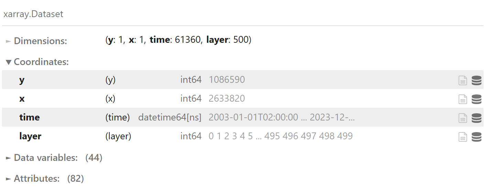

# Result Viewer

The *FRICOSIPY* result viewer is a *Jupyter Notebook* interactive workbook that contains a few plotting functions to help visualise results of the model. It is designed to provide a few examples of how to manipulate Network Common Data Format (NetCDF) files using the *Xarray* python computing package and provide greater accessibility to those less familiar with programming.

## Visualising an Xarray Dataset

*FRICOSIPY* output files are visualised using the standard *Xarray* dataset. The dataset is structured in 4 dimensions with the following co-ordinates:

- **y** - $y$ co-ordinate of spatial node (northing) [m]
- **x** - $x$ co-ordinate of spatial node (easting) [m]
- **time** - datetime value [yyyy-mm-dd hh:mm]
- **layer** - *subsurface layer [n]

Selecting the *data variables* tab will reveal the names and details of all output variables. Each can be selected by typing the dataset name ( `ds` ) followed by a period ( `.` ) and the exact name of the desired output variable ( *eg.* `ds.SHORTWAVE` will access the net shortwave radiation data ).

Selecting the *attributes* tab will reveal a list of all the parameterisation choices and the values selected for all simulation paramters.

<small> **Figure 6**: FRICOSIPY Output NetCDF Dataset</small>

!!! note
    If the user disabes the subsurface variables ( `full_field = False` in `config.py` ), the dataset will be reduced to 3 dimensions excluding the layer co-ordinate. 

## Point Surface Energy Balance

## Point Surface Mass Balance

