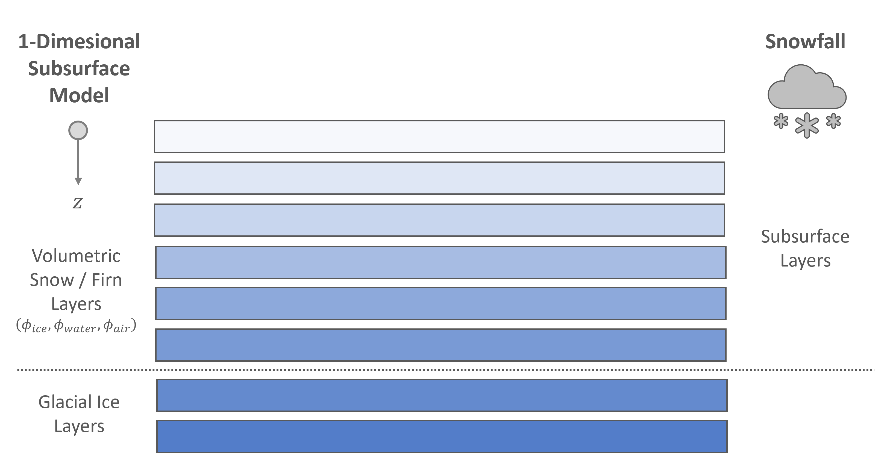

# Multi-layer Subsurface Model

In the *FRICOSIPY* model, the subsurface is discretised according to an *Lagrangian* re-meshing algorithm: layers can translate vertically along the depth axis $(z)$ following mass exchange at the surface. Subsurface layers are regulated by a user-defined, fixed height threshold $(h_{\text{max}})$, upon exceeding which a new surface layer is created for further accumulation and all existing layers are shifted downwards.

Subsurface layers are defined according to their volumetric fraction of ice $(\phi_{\text{ ice}})$, water $(\phi_{\text{ water}})$, and air  $(\phi_{\text{ air}})$, with most of their inherent physical properties being derived from this volumetric composition.

<small> **Figure 6**: FRICOSIPY Multi-layer Subsurface Model </small>

## Precipitation

The input precipitation data $(P_{\text{ ref}})$ from the meteorological input file is adjusted to each spatial node $(x,y)$ according to a linear, elevation-dependant precipitation lapse rate $(\Gamma_{\text{ lapse}})$ and a precipitation multiplier $(M)$.

$$
P (x,y) = P_{\text{ ref}} \: \left[\: 1 + (Z (x,y) - Z_{\text{ ref}}) \: \Gamma_{\text{ lapse}} \: \right] \: M
$$

<small>where $P_{\text{ ref}}$ and $Z_{\text{ ref}}$ are the reference precipitation data and altitude of the input meteorological dataset, $Z (x,y)$ is the elevation of the spatial node, $\Gamma_{\text{ lapse}}$ is the linear precipitation lapse rate and $M$ is the precipitation multiplier. </small>

!!! note

    It is important to ensure that the reference altitude $(Z_{\text{ ref}})$ of the meteorological station is correctly set for the `station_altitude` parameter in the `parameters.py` file.

The *FRICOSIPY* model then uses a linear logistic transfer function based on the nodal air temperature to differentiate between solid and liquid precipitation. The proportion of snowfall scales between 100 % at 0 °C and 0 % at 2 °C [(Hantel et al., 2000)](https://doi.org/10.1002/(SICI)1097-0088(200005)20:6<615::AID-JOC489>3.0.CO;2-0). Snow is accumulated into the uppermost subsurface layer; rain is directly routed as liquid into the [percolation scheme](https://fricosipy.readthedocs.io/en/latest/subsurface_model/#percolation-refreezing).

### Advanced Precipitation Methods

??? "**$(i)$ Three-Phase Anomaly**"

### Fresh Snow Density Parameterisations

By default, the density of fresh snow layers $(\rho_{\text{ fresh snow}})$ is defined by the `fresh_snow_density` parameter. However, the user can also select a more advanced parameterisation to determine a value based on the concurrent meteorological conditions:

??? "**$(i)$ Vionnet et al. (2012)**"

     
    Using the parameterisation of [Vionnet et al (2012)](https://doi.org/10.5194/gmd-5-773-2012), the density of fresh snow $(\rho_{\text{ fresh snow}})$ is emperically-derived based on air temperature $(T_a)$ and wind speed $(V)$:
    
    

    $$
    \rho_{\text{ fresh snow}} = \text{max} \left[ \: 109.0 + 6.0 \: T_a + 26.0 \: V^2 , \rho_{\text{ min}} \: \right]
    $$
    

    <small>where $\rho_{\text{ min}} = 50$ kg m$^{-3}$ is the minimum fresh snow density. </small>

## Percolation & Refreezing

### Irreducible Water Content Parameterisations

??? "**$(i)$ Coleou et al. (1998)**"

### Hydraulic Conductivitiy Parameterisations

??? "**$(i)$ Shimizu (1970)**"

---

??? "**$(ii)$ Calonne et al. (2012)**"

 

---

!!! note

    The parameterisations for hydraulic conductivity $(\Theta)$ are only applicable for users using the Darcy [(Hirashima et al., 2010)] percolation scheme.

## Thermal Diffusion

Thermal diffusion is governed by the *Fourier* heat equation:

$$
\frac{\delta T}{\delta t} = K \: \frac{\delta^{2} T}{\delta z^{2}} = \frac{k}{\rho \: c_p} \: \frac{\delta^{2} T}{\delta z^{2}}
$$

<small>where $K$ is the thermal diffusivity (m$^2$ s$^{-1}$), $k$ is the thermal conductivity (W m$^{-1}$ K$^{-1}$), $\rho$ is the density (kg m$^{-3}$) and $c_p$ is the specific heat capacity under constant pressure (J kg$^{-1}$ K$^{-1}$).  </small>
  
In the *FRICOSIPY* model, the heat equation is numerically solved using an explicit, second-order central difference scheme, constrained between two boundary conditions; 
the derived surface temperature $(T_{s})$ from the resolution of the [surface energy balance](https://fricosipy.readthedocs.io/en/latest/surface_energy_balance/) (*Dirichlet*) and a basal / geomethermal heat flux (*Neumann*).

$$
T_i^{\text{ new}} = T_i + \Delta t_{\text{stable}} \left[ \frac{ \frac{K_{i+1/2}\:(T_{i+1} - T_i)}{\Delta z_{i+1/2}} - \frac{K_{i-1/2}\:(T_i - T_{i-1})}{\Delta z_{i-1/2}} }{ \Delta z_i } \right] \qquad (\text{intermediary nodes})
$$

$$
T_n^{\text{ new}} = T_n + \Delta t_{\text{stable}} \left[ \frac{ \frac{Q_{\text{basal}} K_n}{k_n} - \frac{K_{n-1/2} (T_n - T_{n-1})}{\Delta z_{n-1/2}} }{ \frac{1}{4} z_{n-1} + \frac{3}{4} z_n } \right] \qquad (\text{basal node})
$$

<small>where $i$ is a given subsurface layers, $i \pm 1/2$ represents the interface property between i and the adjacent subsurface layer, $n$ is the total number of subsurface layers, $Q_{\text{ basal}}$ is the basal / geothermal heat flux (W m$^{-2}$) and $\Delta t_{\text{stable}}$ is the stable integration timestep. </small>

The stable integration timestap $(\Delta t_{\text{stable}})$ is determined according to the *Von Neumann* stability condition:

  
$$
\Delta t_{\text{stable}} \le \frac{1}{2} \min \left( \frac{\Delta z_{i+1/2}^2}{K_{i+1/2}} \right)
$$

### Thermal Conductivitiy Parameterisations

??? "**$(i)$ Bulk-volumetric**"

      
    The bulk-volumetric method is the default approach of the original *COSIPY* model. Thermal conductivity $(k)$ is calculated as a volumetrically-weighted sum of reference values for ice, water and air.
    
    

    $$
    k (\phi) = k_{\:i} \: \phi_{\:i} + k_{\:w} \: \phi_{\:w} + k_{\:a} \: \phi_{\:a}
    $$
    

    <small>where $k_{\:i}$ = 2.22, $k_{\:w}$ = 0.55 & $k_{\:a}$ = 0.024 W m$^{-1}$ are the reference thermal conductivities and $\phi_{\:i}$,$\phi_{\:w}$ & $\phi_{\:a}$ are the volumetric fractions of ice, water and air respectively. </small>
    
---

??? "**$(ii)$ Sturm (1997)**"

      
    Using the parameterisation of [Sturm (1997)](https://doi.org/10.3189/S0022143000002781), thermal conductivity $(k)$ is empirically-derived based on observational data.
    
    

   
    $$
    k = 0.138 - 1.01 \: \rho + 3.233 \: \rho^2
    $$

    

    <small>where $\rho$ (kg m$^{-3}$) is the density of subsurface layers. </small>
    
---

??? "**$(iii)$ Calonne et al. (2019)**"

      
    Using the parameterisation of [Calonne et al. (2019)](https://doi.org/10.1029/2019GL085228), thermal conductivity $(k)$ is empirically-derived based on 3-dimensional image-based computations.
    
    

    
    $$
    k(\rho,T) = (1-\vartheta) \frac{k_{i}(T) \: k_{\:a}(T)}{k_{\:i}^{\text{ ref}} k_{\:a}^{\text{ ref}}} k_{\text{ snow}}^{\text{ ref}}(\rho) + \vartheta \frac{k_{\:i}(T)}{k_{\:i}^{\text{ ref}}} k_{\text{ firn}}^{\text{ ref}}(\rho)
    $$

    $$
    \vartheta = 1 / \left[ 1 + \text{exp}(-2a \: (\rho - \rho_{\:\text{ transition}})) \right]
    $$
    
    $$
    k_{\text{ firn}}^{\text{ ref}} = 2.107 + 0.003618 \: (\rho - \rho_{i})
    $$
    
    $$
    k_{\text{ snow}}^{\text{ ref}} = 0.024 - 1.23\rho \times 10^{-4} + 2.5 \times 10^{-6}\rho^2
    $$
    
    

    <small>where $k_{\:i}(T)$ and $k_{\:a}(T)$ are the ice and air thermal conductivity at the temperature T, $k_{\:i}^{\text{ ref}}$ = 2.107 and $k_{\:a}^{\text{ ref}}$ = 0.024   W m$^{-1}$ K$^{-1}$ are the ice and air thermal conductivities at the reference temperature of -3 $^\circ$C, $a$ = 0.02 m$^{3}$ kg$^{-1}$ and $\rho_{\:\text{transition}}$ = 450 kg m $^{-3}$. </small>
    

### Specific Heat Capacity Parameterisations

??? "**$(i)$ Bulk-volumetric**"

      
    The bulk-volumetric method is the default approach of the original *COSIPY* model. Specific heat capacity $(c_p)$ is calculated as a volumetrically-weighted sum of reference values for ice, water and air.
    
    

    $$
    c_p (\phi) = c_{\:p,i} \: \phi_{\:i} + c_{\:p,w} \: \phi_{\:w} + c_{\:p,a} \: \phi_{\:a}
    $$
    
    

    <small>where $c_{\:p,i}$ = 2050, $c_{\:p,w}$ = 4217 & $c_{\:p,a}$ = 1004.67 J kg$^{-1}$ K$^{-1}$ are the reference specific heat capacities (for constant pressure) and $\phi_{\:i}$,$\phi_{\:w}$ & $\phi_{\:a}$ are the volumetric fractions of ice, water and air respectively. </small>

---

??? "**$(ii)$ Yen (1981)**"

      
    Using the parameterisation of [Yen (1981)](https://apps.dtic.mil/sti/citations/ADA103734), specific heat capacity $(c_p)$ is empirically-derived based on observational data.
    
    

    $$
    c_p (T) = 152.2 + 7.122 \: T
    $$
    

    

## Dry Firn Densification

Dry firn densification $(\frac{\delta \rho}{\delta t})$ is the process by which snow transforms over time into glacial ice due to overburden pressure and thermal metamorphosis. This excludes the effects of subsurface liquid refreezing, which is already accounted for in the [refreezing module](https://fricosipy.readthedocs.io/en/latest/subsurface_model/#percolation-refreezing).

### Firn Densification Parameterisations

??? "**$(i)$ Boone (2002)**"

---

??? "**$(ii)$ Ligtenberg et al. (2011)**"

     
    The parameterisation of [Ligtenberg et al. (2011)]() is an enhancement of the semi-empirical method of [Arthern et al. (2010)](), based on the processes of sintering and lattice-diffusion creep of consolidated ice, that adds a dependence on the local accumulation rate $(C)$:
    
    

    $$
    \frac{d\rho}{dt} = C \: \: c_{\text{ lig}} \: g \:(\rho - \rho_{\text{ ice}}) \: \text{exp} \left( -\frac{E_{\text{c}}}{RT} + \frac{E_{\text{g}}}{R\overline{T}} \right)
    $$
    $$
    c_{\text{ lig}} \: (C,\rho) =
    \begin{cases}
    0.0991 - 0.0103 \:\: \text{log}(C), & \rho \lt 550 \: \text{kg\:m}^{-3} \\
    0.0701 - 0.0086 \:\: \text{log}(C), & \rho \geq 550 \: \text{kg\:m}^{-3}
    \end{cases}
    $$
    

    <small> where $C$ is the accumulation rate (mm yr$^{-1}$), $\rho$ is the layer density (kg m$^{-3}$), $T$ is the current layer temperature ($^\circ$C), $\overline{T}$ is the average layer temperature of the preceding year ($^\circ$C), $R$ = 8.314 J      mol$^{-1}$ K$^{-1}$ is the universal gas constant and $E_{\text{c}}$ = 60 kJ mol$^{-1}$ and $E_{\text{g}}$ = 42.4 kJ mol$^{-1}$ are the activation energies associated with creep by lattice diffusion and grain growth respectively. </small>

## Snow Metamorphism

### Snow Metamorphism Parameterisations

??? "**$(i)$ Katsushima et al. (2009)**"

## Exemplar Temperature-Depth Profile

## Exemplar Density-Depth Profile

