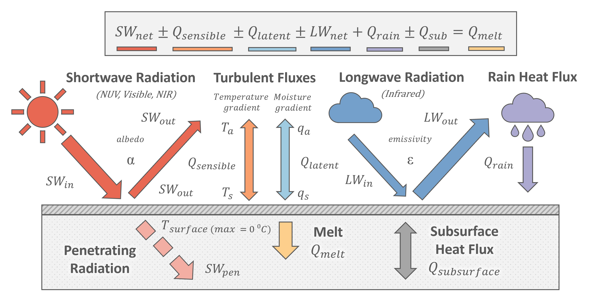
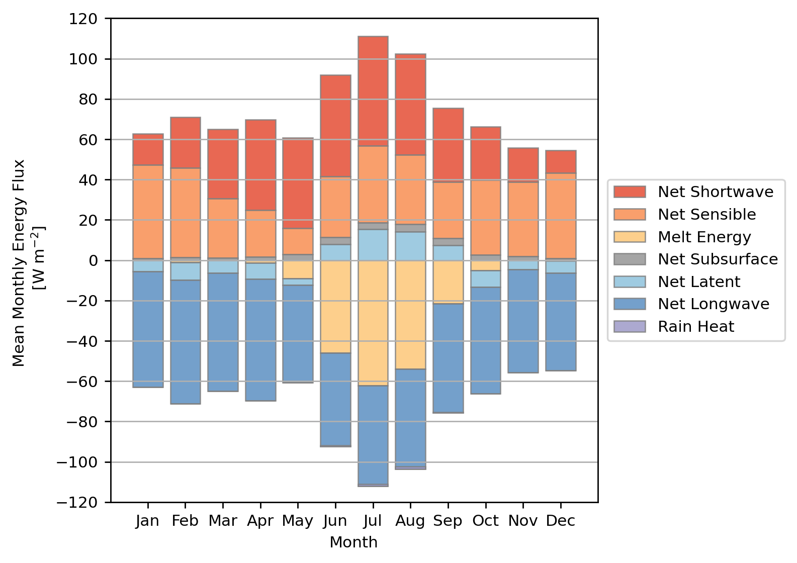

# Surface Energy Balance

Driven by the input meteorological data, the surface energy fluxes are evaluated at an infinitesimal skin layer to ascertain the surface temperature ($T_s$). Based on the principles of energy conservation:

$$
SW_{net} \pm Q_{sensible} \pm Q_{latent} \pm LW_{net} + Q_{rain} \pm Q_{subsurface} = 0
$$

<small>where $SW_{net}$  is the net shortwave radiation flux, $Q_{sensible}$  and $Q_{latent}$  are the turbulent fluxes for sensible and latent exchange respectively, $LW_{net}$  is the net longwave radiation flux, $Q_{rain}$  is the rain heat flux and $Q_{subsurface}$  is the subsurface heat conduction flux.</small>

<small> **Figure 2**: FRICOSIPY Surface Energy Balance </small>

!!! note

    By convention, positive values $(+)$ represent energy absorbed by the glacier surface; negative values $(-)$ depict energy emitted from the glacier surface.

However, since the surface temperature of a glacier is physically constrained to its melting point, excess energy must be apportioned to melt ($Q_{melt}$) should the surface temperature reach 0 $^\circ$C:

  

    \( \text{if } T_s = 0 \:^\circ\text{C}\: :\)
  

  $$
  SW_{net} \pm Q_{sensible} \pm Q_{latent} \pm LW_{net}
  + Q_{rain} \pm Q_{subsurface} = Q_{melt}
  $$

The *FRICOSIPY* model uses an iterative approach to equalise the energy fluxes; the user can select either a Limited-memory *Broyden*–*Fletcher*–*Goldfarb*–*Shanno* algorithm (L-BFGS) algorithm, the Sequential Least SQuares Programming (SLSQP) approach or the *Newton*-*Raphson* method.

The following section explains each of these energy fluxes in greater detail and how they are parameterised in the *FRICOSIPY* model.

##   Shortwave Radiation

Shortwave radiation is the thermal radiation supplied directly from the Sun that ranges from the near-ultraviolet (NUV), through the visible light (VIS) and to the near-infrared (NIR) ranges ($\sim$ 0.2 - 3 $\mu$m) of the electromagnetic spectrum. In the FRICOSIPY model, shortwave radiation is modelled after [Iqbal (1983)](https://doi.org/10.1016/B978-0-12-373750-2.X5001-0) and [Klok & Oerlemans (2002)](https://doi.org/10.3189/172756502781831133):

$$
I_{0} = I_{TOA} \: \Lambda ( x , y ) \: \tau_{rg} \: \tau_{w} \: \tau_{aerosols} \: \tau_{clouds} 
$$

<small>where $I_{0}$ is the solar irradiance, $I_{TOA}$ is the unattenuated Top-of-Atmosphere (TOA) solar irradiance on a surface normal to the incident radiation, $\Lambda$ is a correction factor for an inclined surface relative to the topography of a spatial node ( $x$ , $y$ ) and $\tau_{rg}$, $\tau_{w}$, $\tau_{aerosols}$ & $\tau_{clouds}$ are the coefficients of atmospheric transmissivity for *Rayleigh* scattering and gaseous absorption, water absorption, aerosols and cloud cover respectively .</small>

The coefficients of atmospheric transmissivity that  *Rayleigh* scattering and gaseous absorption ($\tau_{rg}$), water absorption ($\tau_{w}$) and the attenuation by aerosols ($\tau_{aerosols}$) are modelled after [Kondratyev (1969)](https://shop.elsevier.com/books/radiation-in-the-atmosphere/kondratyev/978-0-12-419050-4), [McDonald (1960)](https://doi.org/10.1175/1520-0469(1960)017%3C0319:DAOSRB%3E2.0.CO;2) and [Houghton (1954)](https://doi.org/10.1175/1520-0469(1954)011%3C0001:OTAHBO%3E2.0.CO;2) respectively. The final component, the attenuation by cloud cover ($\tau_{clouds}$), is modelled after [Gruell et al. (1997)](https://doi.org/10.1029/97JD02083):

$$
\tau_{clouds} = 1 - a \: N - b \: N^2
$$

<small>where $a = 0.233$ and $b = 0.415$ are cloud transmissivity coefficients (default values) and $N$ is the fractional cloud cover. </small>

The incoming shortwave radiation ($SW_{in}$) is computed as the sum of the direct and diffuse components of the solar irradiance, after [Oerlemans (1992)](https://doi.org/10.3189/S0022143000003634); spatial nodes shaded by surrounding topography only receive diffuse radiation.

$$
SW_{in}
=
I_{0}\Bigg[
\underbrace{\,0.2 + 0.65(1 - N)\,}_{\text{direct radiation}}
\;+\;
\underbrace{\,0.8 - 0.65(1 - N)\,}_{\text{diffuse radiation}}
\Bigg]
$$

<small>where $SW_{in}$ is the incoming shortwave radiation, $I_{0}$ is the solar irradiance and $N$ is the fractional cloud cover.</small>

The net shortwave radiation ($SW_{net}$) entering the energy balance is calculated using a broadband isotropic albedo ($\alpha$), that determines the proportion of incoming radiation reflected off the surface. The user can also optionally apportion some of the input shortwave radiation to directly bypass the surface energy balance and directly warm the subsurface layers.

$$
SW_{net} = SW_{in} \: (1 - \alpha) - SW_{pen}
$$

<small>where $SW_{net}$ is the net shortwave radiation, $SW_{in}$ is the incoming shortwave radiation, $\alpha$ is the broadband albedo and $SW_{pen}$ is the optional penetrating shortwave radiation deduction.</small>

### Albedo Parameterisations 

??? "**$(i)$ Oerlemans & Knap (1998)**"

     
    Using the parameterisation of [Oerlemans and Knap (1998)](https://doi.org/10.1017/S0022143000002574), the evolution of the broadband albedo   
    ($\alpha$) is modelled as an exponentially decreasing function of time $t$ since the last significant snowfall event.

    

    $$
    \alpha = \alpha_{firn} + \left[ (\alpha_{fresh\:snow} - \alpha_{firn}) \: e^{-\frac{t}{t*}} \right]
    $$
    

    <small>where $\alpha_{fresh\:snow} = 0.85$ and $\alpha_{firn} = 0.52$ are the albedo of fresh snow and firn respectively (default values), and $t^*$ is the characteristic decay timescale parameter (days).</small>

---

??? "**$(ii)$ Bougamont et al. (2005)**"

     
    The parameterisation of [Bougamont et al. (2005)](https://doi.org/10.1029/2005JF000348) is an enhancement of the [Oerlemans and Knap (1998)](https://doi.org/10.1017/S0022143000002574) approach that introduces a surface temperature-dependent albedo decay timescale that enables both a faster decay on a melting surface and slower metamorphism in cold conditions.

    

    $$
    t^*= 
    \begin{cases}
    t^*_{\:wet}\:, & T_{s} = \: 0\:^\circ \text{C} \\
    t^*_{\:dry} +  K \left[ \text{max}\:(T_{s}\:,\:T_{\text{max}\:,\:t^*}) \right]\:,&  T_{s} < \: 0\:^\circ \text{C}
    \end{cases}
    $$
    

    <small>where $t^∗_{\:wet}$ and $t^∗_{\:dry}$ are the decay timescales (days) for a melting and dry surface respectively, $K$ is a calibration parameter (day $^\circ$C$^{−1}$) and $T_{\text{max}\:,\:t^∗}$ is a temperature threshold ($^\circ$C) for the decay timescale adjustment.</small>

### Penetrating Radiation Parameterisation 

??? "**$(i)$ Bintanja & van den Broeke (1995)**"

     
    If the user enables the penetrating radiation module, the absorbed radiation ($SW_{pen}$) at depth `$z$' is calculated using the parametersiation of [Bintanja and Van den Broeke (1995)](https://doi.org/10.1175/1520-            0450(1995)034%3C0902:TSEBOA%3E2.0.CO;2):

    

    $$
    SW_{pen} (z) = \lambda_{abs} \: SW_{in} \: (1 - \alpha) \: e^{-z \: \beta}
    $$
    

    <small>where $\lambda_{abs}$ is the fraction of absorbed shortwave radiation ($0.8$ for ice, $0.9$ for snow) and $\beta$ is the extinction coefficient ($2.5$ m$^{-1}$ for ice, $17.1$ m$^{-1}$ for snow as the default values).</small>

##  Longwave Radiation

Longwave radiation (otherwise known as terrestrial radiation) is the thermal radiation emitted between the Earth's surface and atmosphere that is within the infrared classification (3 - 100 $\mu$m) of the electromagnetic spectrum. Net longwave radiation ($LW_{net}$) is calculated in accordance with the *Stefan*–*Boltzmann* law for grey body emission:

$$
LW_{net} = LW_{in} - \varepsilon_{s} \: \sigma \: T_{s}^{4}
$$

<small>where $LW_{net}$  is the net longwave radiation flux, $LW_{in}$ is the incoming longwave radiation, $\varepsilon_{s} \approx 0.99$ is the surface emissivity, $\sigma = 5.67 \times 10^{-11}$ W m$^{-2}$ K$^{-4}$ is the *Stefan*-*Boltzmann* constant and $T_s$ is the surface temperature (K).</small>

---

### Longwave Radiation Parameterisation 

??? "**$(i)$ Konzelmann et al. (1994)**"

     
    If the user is unable to provide incoming longwave radiation ($LW_{in}$) in the input meterological data, it can instead by derived from the fractional cloud cover ($N$) using the parametersiation of [Konzelmann et al. (1994)](https://doi.org/10.1016/0921-8181(94)90013-2). This substitutes the air temperature ($T_a$) and atmospheric emissivity   ($\varepsilon_{atm}$) into the *Stefan*-*Boltzmann* law:

    

    $$
    LW_{in} = \varepsilon_{atm} \: \sigma \: T_{a}^{4}
    $$
    $$    
    \varepsilon_{atm} = \varepsilon_{cs} \: ( 1 - N^2) + \varepsilon_{clouds} \: N^2
    $$    
    $$
    \varepsilon_{cs} = 0.23 + c_{emission} \left[ \frac{VP_{sat} \: RH}{T_a} \right]
    $$
    

    <small>where $LW_{in}$ is the derived incoming longwave radiation, $\varepsilon_{atm}$, $\varepsilon_{cs}$ and $\varepsilon_{clouds} = 0.96$ are the atmospheric, clear-sky and cloud emissivities respectively, $N$ is the fractional cloud cover, $RH$ is the relative humidity (%), $VP_{sat}$ is the saturated vapour pressure (Pa), $T_a$ is the air temperature (K) and $c_{emission} = 0.4$ is a calibration parameter.</small>

## Turbulent Fluxes

The turbulent fluxes represent heat and moisture exchange between the atmosphere and the glacier surface, driven by the convective, turbulent motions of the air within the atmospheric boundary layer. In the *FRICOSIPY* model, these exchanges are calculated using bulk aerodynamic equations, which are governed by wind speed, surface roughness, and the gradients of temperature and humidity between the glacier surface and the overlying air.

###  Sensible Heat Flux

The sensible heat flux represents the transfer of heat energy and is driven by the temperature gradient ($\Delta T$) between the atmosphere and the glacier surface.

$$
Q_{sensible} = \rho_{a} \: c_{p,a} \: C_{h} \: V \:(T_{a}-T_{s})
$$

<small> where $\rho_\text{a}$ is the dry air density (kg m$^{-3}$), $c_{\text{p,a}}$ is the specific heat of dry air under constant pressure (J kg$^{-1}$ K$^{-1}$), $V$ is the wind speed (m s$^{-1}$), $T$ is the air temperature (K) and the $s$ and $a$ subscripts refer to the surface and the atmosphere at a measurement height of 2 metres respectively. </small> 

###  Latent Heat Flux

The latent heat flux represents the transfer of latent energy (associated with phase changes) and is driven by the moisture gradient ($\Delta q$) between the atmosphere and the glacier surface.

$$
Q_{latent} = \rho_{a} \: L_{s,v} \: C_{h} \: V \:(q_{a}-q_{s})
$$

<small> where $\rho_\text{a}$ is the dry air density (kg m$^{-3}$), $V$ is the wind speed (m s$^{-1}$), $L_{\text{s,v}}$ is the latent heat of sublimation or vaporisation   (J kg$^{-1}$), $q$ is the specific humidity (kg kg$^{-1}$) and the $s$ and $a$ subscripts refer to the surface and the atmosphere at a measurement height of 2 metres respectively.</small> 

The mass exchange associated with the latent heat flux depends on the glacier surface temperature and the direction of the moisture gradient ($\Delta q$):

| Process | Energy Exchange | Mass Exchange | Surface Temperature |
|-----------|----------|-----------|------------|
| **Deposition** | Exothermic $(+)$ | Accumulation $(+)$ | $< 0$ $^\circ$C |
| **Condensation** | Exothermic $(+)$ | Accumulation $(+)$ | $= 0$ $^\circ$C |
| **Evaporation** | Endothermic $(-)$ | Ablation $(-)$ | $= 0$ $^\circ$C |
| **Sublimation** | Endothermic $(-)$ | Ablation $(-)$ | $< 0$ $^\circ$C |

### Turbulent Exchange Parameterisation

??? "**$(i)$ Essery and Etchevers (2004)**""

     
    The parameterisation of [Essery and Etchevers (2004)](https://doi.org/10.1029/2004JD005036) 

    

    $$ C_{h} =  C_{hn} \: \Psi_{Ri} $$
    $$ C_{hn} = \kappa^{2} \left[ \text{log} \left( \frac{z_{a}}{\mu} \right) \right] ^{-2} $$
    

    <small>where $C_{hn}$ is the value under neutral conditions, $\kappa$ is the von Karman constant (0.40) and $\mu$ is the surface roughness (m).</small>

    The stability function ($\Psi_{Ri}$), derived from the bulk Richardson number ($Ri_{b}$), represents the correction for the stability of the
    atmospheric boundary layer.

    

    $$
    \Psi_{Ri}  = 
    \begin{cases}
        (1 + 10 Ri_{\text{b}})^{-1}, & Ri_{\text{b}} \geq 0 \quad \text{(stable)} \\
        (1 - 10 Ri_{\text{b}} \left(1 +10\:C_{\text{hn}} \frac{\sqrt{-Ri_{\text{b}}}}{f_z} \right)^{-1}, & Ri_{b} < 0 \quad \text{(unstable)} 
    \end{cases} 
    $$
    $$
    Ri_{\text{b}} = \frac{g \: z_\text{a}}{V_{\text{a}}^2} \left[ \frac{T_{\text{a}} - T_{\text{s}}}{T_{\text{a}}} + \frac{q_{\text{a}} - q_{s}}{q_{\text{a}}+\epsilon \: (1-\epsilon)} \right] 
    $$
    $$
    f_{z} = \frac{1}{4} \sqrt{\frac{\mu}{z_\text{a}}}
    $$
    

    <small>where $g$ is the gravitational acceleration (m s$^{-2}$) and $\epsilon$ is the ratio of molecular weights between water and dry air.</small>
        

##  Rain Heat Flux

##  Subsurface / Ground Heat Flux

The subsurface heat conduction flux (otherwise known as the ground heat flux) is determined based on the near surface temperature gradient:

$$
Q_{subsurface} = k_{s} \: \left[ \frac{T_{z\:\text{interp 2}} - T_{z\:\text{interp 1}}}{z_{\:\text{interp 2}} - z_{\:\text{interp 1}}} \right]
$$

<small> where $k_{s}$ is the surface thermal conductivity (W m$^{-1}$ K$^{-1}$) and $z_{\:\text{interp 1}} = 0.06$ m and $z_{\:\text{interp 2}} = 0.10$ m are prescribed depth values used to calculate subsurface temperatures via linear interpolation between subsurface layers.</small>

##  Melt Energy Flux

When the surface temperature ($T_s$) is evaluated to 0 $^\circ$C, the residual energy melts the glacier surface - the uppermost subsurface layer of the model. This surface melt, expressed in terms of metre water equivalent (m w.e.) can then be calculated as: 

$$
\text{Surface melt} = \frac{Q_{melt} \:\: dt}{\rho_{w} \: L_{f}}
$$

<small>where $Q_{melt}$  is the melt energy flux, $dt$ is the model time step (s), $\rho_{w} = 1000$ kg m$^{-3}$ is the density of water and $L_{m} = 3.34 \times 10^{5}$ J kg$^{-1}$ is the latent heat of fusion.</small>

This surface melt, combined with any rain or condensation, is then transferred into the percolation routine of the [subsurface model](subsurface_model.md) where it either refreezes (if there is sufficient cold content) or becomes run-off.

## Exemplar Surface Energy Balance

Visualising the Surface Energy Balance (SEB) is important for understanding and analysing the energy exchanges occuring at the glacier surface. **Figure 3** shows an exemplar surface energy balance for the *Plaine Morte* glacier, *Valais*, *Switzerland* produced from the *FRICOSIPY* model. As would be anticipated for a mid-latitude alpine glacier, radiative fluxes dominate the annual energy turnover and melt is mostly confined the summer months.

<small> **Figure 3**: Exemplar Surface Energy Balance (SEB) for the *Plaine Morte* glacier, *Valais*, *Switzerland* </small>

!!! note

    The [*FRICOSIPY result viewer*](result_viewer.md) contains a plotting function that can automatically produce a surface energy balance graph (akin to the figure above) for any output dataset.

