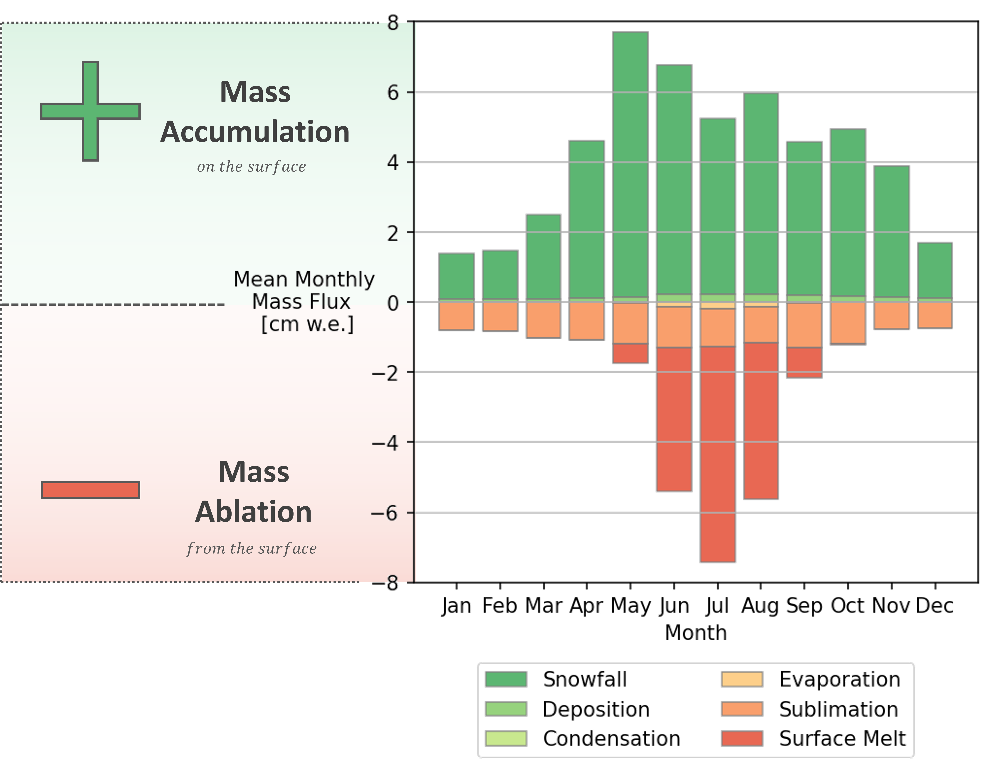

# Surface Mass Balance

The surface mass balance (SMB) is directly coupled to the [surface energy balance](https://fricosipy.readthedocs.io/en/latest/surface_energy_balance/) and can be described by the following equation:

$$
\text{SMB} = \dot{m}_{\text{ precipitation}} + \dot{m}_{\text{ deposition}} + \dot{m}_{\text{ condensation}} - \dot{m}_{\text{ evaporation}} - \dot{m}_{\text{ sublimation}} - \dot{m}_{\text{ melt}}
$$

<small> where $\dot{m}_{\text{ precipitation}}$ is the precipitation (snowfall or rain) mass flux, $\dot{m}_{\text{ deposition}}$ , $\dot{m}_{\text{ condensation}}$ , $\dot{m}_{\text{ evaporation}}$ & $\dot{m}_{\text{ sublimation}}$ are the turbulent mass fluxes associated with latent heat exchange and $\dot{m}_{\text{ melt}}$ is the surface melt mass flux (all units m w.e.). </small>

<small> **Figure 4**: FRICOSIPY Surface Mass Balance</small>

!!! note

    By convention, positive values $(+)$ represent mass accumulated on the glacier surface; negative values $(-)$ depict mass ablated from the glacier surface.

## Exemplar Surface Mass Balance

The Surface Mass Balance (SMB) illustrates the mass exchange occuring at the surface – either accumulation $(+)$ or ablation $(-)$. In contrast to the energy balance, the monthly mass fluxes do not need to be balanced. **Figure 4** shows an exemplar point surface mass balance for *Colle Gnifetti* at the summit of the *Grenz* glacier, *Valais*, *Switzerland* produced from the *FRICOSIPY* model. For *Colle Gnifetti*, being situated in a high-altitude accumulation area, the net mass exchange is positive.

<small> **Figure 4**: Exemplar point Surface Mass Balance (SMB) for *Colle Gnifetti* (*Grenz* glacier), *Valais*, *Switzerland* </small>

!!! note

    The [*FRICOSIPY result viewer*](result_viewer.md) contains a plotting function that can automatically produce a surface mass balance graph (akin to the figure above) for any output dataset.

